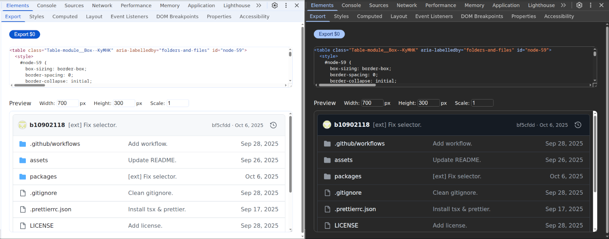

# UI Export

A Chrome DevTool extension that exports any components with CSS inlined.

## Demo

https://github.com/user-attachments/assets/fc23e3d1-1db9-450e-82cf-f82372c49aa9

## Install

### From [Chrome Web Store](https://chromewebstore.google.com/detail/ui-export/igoidllafhdiolciggebbokmhfmpdalo)

### From release:

1.  Download `uiexport.zip` from [releases](https://github.com/devtoolcss/devtoolcss/releases)
2.  Unzip in a folder: `unzip uiexport.zip -d uiexport`
3.  Load unpacked in `chrome://extensions/`

### From source

1.  `pnpm build`
2.  Load unpacked `dist/`

Dev tips: use `pnpm watch` to auto update `dist/` (still need load unpack in browser).
